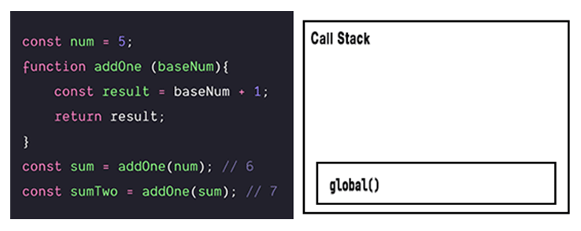

In order for JavaScript to operate in the way that it does, it relies on three core components:

- Memory 
- The Thread of Execution
- The Call Stack

## Memory and The Thread of Execution

When a JavaScript program runs it goes through the code, line-by-line, and executes each line. This process is referred to as the Thread of Execution.

During this process, the program saves data (strings, arrays, and even functions) so that it can be used later. That data is saved in the program's Memory.

These two parts (Memory and the Thread of Execution) make up what is known as an Execution Context.

The main program has it's own (global) Execution Context. In addition, as soon as a function is executed within the program, a new (local) execution context will be created specific to that function.

The program will then enter that new context, run all of the code in that function's local context, and then exit (`return`) out into the previous execution context. It can not continue on down the page while it is running that function, simultaneously. This inabiliy to execute more than one thing at a time is why JavaScript is referred to as a "Single-Threaded" language - it only has _one_ single thread of execution.

The memory inside of a function's execution context can also be thought of as it's "Local Memory". It is only available while running the function code and not anywhere outside that block.

## The Call Stack

So you might ask, how does JavaScript keep track of where it is within a program?

This is where the third component comes in - the Call Stack.

A call stack is a traditional way of storing information on our computer. We have a number of ways of doing this in JavaScript - we have arrays, we have objects, and we also have what's called "stacks".

The one key thing to note about the Call Stack is that the program is only engaged with the very top item on the stack at any given moment. That said, whatever is at the top of the Call Stack is where the program is at that moment in the Thread of Execution.

At the very bottom of the Call Stack there will always be the Global Execution Context. When items are added to the Call Stack, the program will run those top items and then eventually return to the Global Execution Context (`global()`) when everything above it has been executed and removed.

## Putting it all together

Let's demonstrate everything we've discussed so far with a more visual example.

```js
const num = 5;
function addOne (baseNum){
	const result = baseNum + 1;
	return result;
}
const sum = addOne(num); // 6
const sumTwo = addOne(sum); // 7
```

The above code would be executed (line-by-line) in the following way:

1. Define the constant `num` (in global memory) and assign it the value of `5`.
2. Define the function `addOne` (in global memory). Note: when we define a function, there are two parts:
	a. Define the label/identifier for that function (`addOne`, in this case).
	b. Store all of the code in the function into memory (we do not execute anything at this point).
3. Define the constant `sum` (in global memory) and assign it the value returned by `addOne(num)`.
4. Execute `addOne(num)`, add it to the Call Stack, and create a new Execution Context for that function block.
5. Enter the new Execution Context for `addOne` and:
	a. Assign the parameter of `baseNum` with the value (argument) of `5` (in local memory).
	b. Define the constant `result` (in local memory) and assign it the value of the operaton on the right hand side - which is immediately run, added to the Call Stack, and evaluated to `6`.
	c. In our local memory, locate the data stored with the label `result` and `return` it - ship it out of the functions Local Execution Context into the Global Execution Context. This function execution then evaluates to the value returned in `result` - in this case, `6`.
6. Moving back out to the Global Execution context, the returned value of `6` will be assigned (in global memory) to `sum`.
7. Define the constant `sumTwo` (in global memory) and assign it the value returned by `addOne(sum)`.
8. Repeat step 5 for the call to execute `addOne(sum)`:
	a. Add it to the Call Stack and create a new Execution Context for the function block.
	b. Enter the new Execution Context for the second call to `addOne()`.
	b. Assign `baseNum` the value of `sum` (in local memory), which has not been stored as `6`.
	c. Define constant `result` (in local memory) and assign it the value of the operaton on the right hand side - which is immediately run, added to the Call Stack, and evaluated to `7`.
	d. In our local memory, locate the data stored with the label `result` and `return` it to the Global Execution Context.
9. In the Global Execution Context, assign the returned value of `7` to `sumTwo`.

Here is a visual representation of the Call Stack during this process:



This demonstrates how each function/operation is being executed, that item is added to the top of the Call Stack and then removed after it is completed.

### References & Resources

- [Frontend Masters - JavaScript: The New Hard Parts](https://frontendmasters.com/courses/javascript-new-hard-parts) – course by [Will Sentance](http://willsentance.com/)
- [Frontend Masters - JavaScript: The Hard Parts, v2](https://frontendmasters.com/courses/javascript-hard-parts-v2) – course by [Will Sentance](http://willsentance.com/)