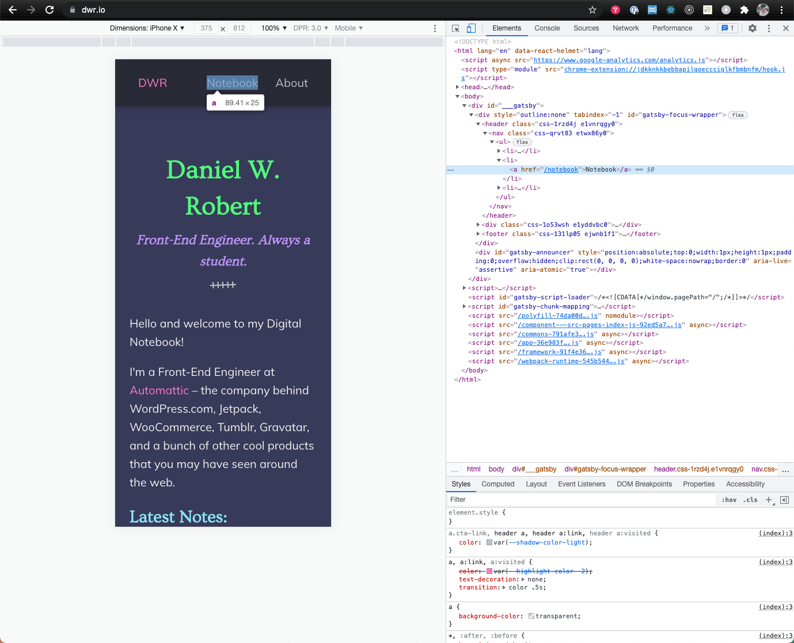
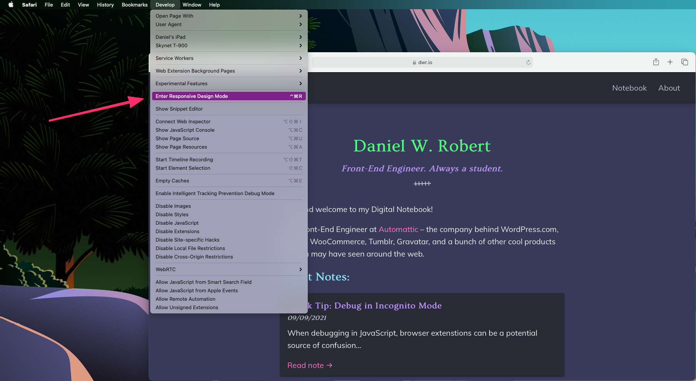
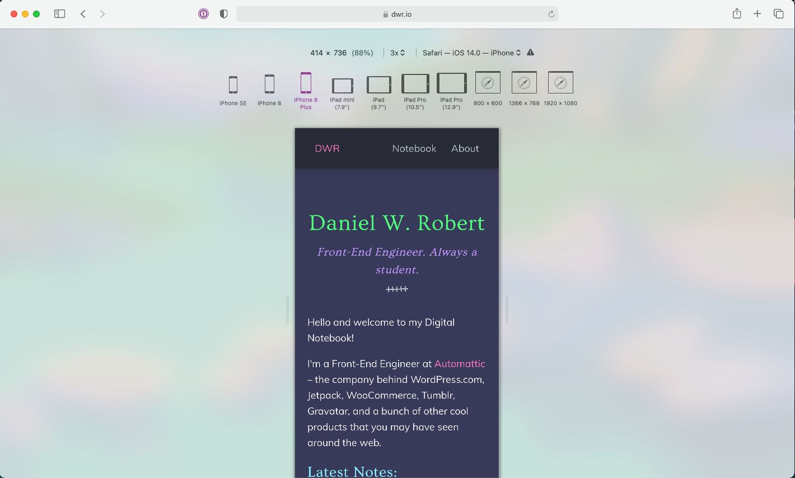

Typically, when I need to debug something with dev tools on a mobile layout, Chrome’s device toolbar is sufficient enough.

Occasionally, it’s necessary to debug right on the device, since certain things differ between Safari and Chrome’s emulation.

The downside is that, at the time of writing this, you can’t use dev tools on your mobile device over a wireless connection - you have to plug your phone into your computer.

There is, however, a middle-of-the-road option for when you aren’t able to plug your iOS device into your computer. You can debug your web app from Safari on your desktop and use Safari’s browser dev tools via **Enter Responsive Design Mode** under the **Develop** menu item.

While this won’t account for device-specific issues, you will still get a much more accurate picture of what things will look like on iOS Safari than you would using Chrome’s device toolbar.